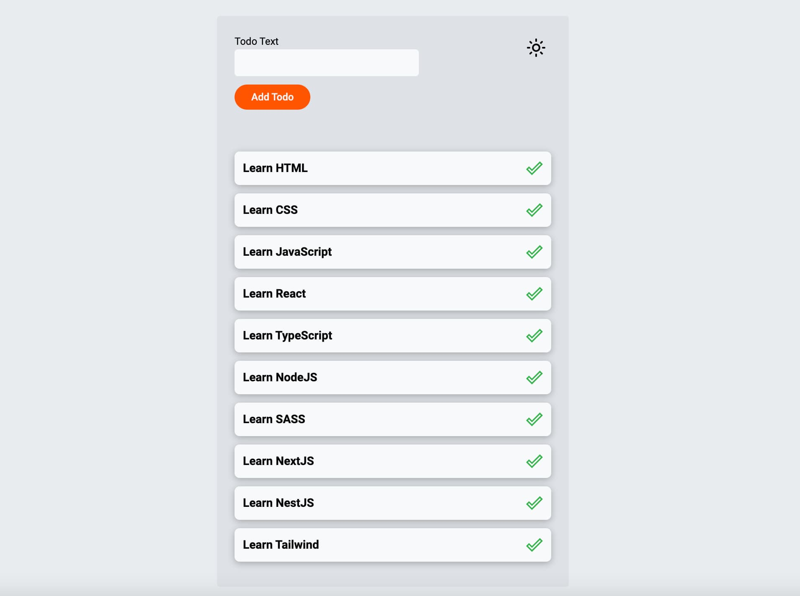
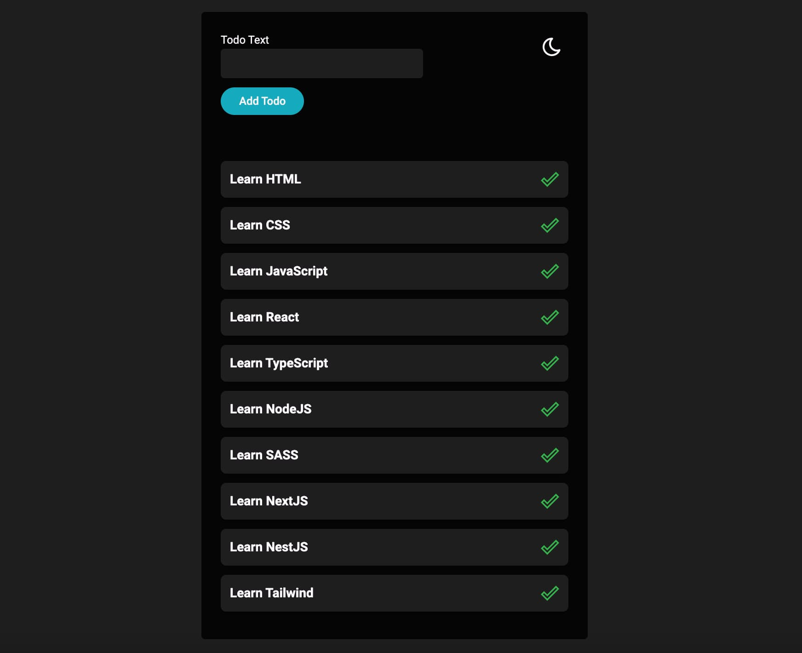

# Todo Plus+

Todo Plus+ is a modern todo list application built with React and TypeScript. Seamlessly manage your tasks with features such as adding and deleting todo items. Enhance your productivity by switching between light and dark themes. Todo Plus+ utilizes local storage to ensure your todo items persist even when you close the app. Experience a clean and intuitive interface, styled with Styled Components, and enjoy real-time notifications with React Toastify.

## Built With

- 
- 
- 
- 
- 
- 

## Table of Contents

- [Features](#features)
- [Technologies](#technologies)
- [Screenshots](#screenshots)
- [Issues](#Issues)
- [License](#License)
- [Feedback](#Feedback)

## Features

- Add and delete todo items
- Switch between light and dark themes
- Local storage for persistent data

## Technologies

- React
- TypeScript
- Styled Components
- Local Storage
- React Icons
- React Toastify

## Project Preview

### Screenshots:

_Caption for Screenshot 1 (Light Theme)_

_Caption for Screenshot 2 (Dark Theme)_

## Issues

If you encounter any issues or have suggestions, please [open an issue](https://github.com/Alexandrbig1/movies-info/issues).

## License

This project is licensed under the [MIT License](LICENSE).

## Feedback:

I welcome feedback and suggestions from users to improve the application's functionality and user experience.

## Languages and Tools:

  
 

## Connect with me:

  

  

